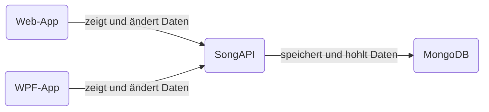

Bei diesen Projekt handelt es sich um das Semesterprojekt für POS in der 4 AHINF. Die Anforderungen waren es eine API zu entwickeln auf die 2 Clients zugreifen. Die Clients sollen dabei eine Webseite und eine WPF-App sein. 

Bei meiner Idee handelt es sich um eine einfache Song API bei der es möglich ist mithilfe der Website oder der WPF-App die Daten seiner Lieblingssongs zu erfassen und diese dann in der API zu speichern.

## Inhaltsverzeichnis

- [Softwaredesign](#softwaredesign)
- [Beschreibung der Software](#beschreibung-der-software)
- [API Beschreibung](#api-beschreibung)
- [Diagramm](#diagramm)
- [Diskussion](#diskussion)

## Softwaredesign



##### SongAPI
Die Song API ist der Mittelpunkt des Projektes und verwaltet alle Daten und speichert diese auch in die Datenbank. Die API wurde von mir mit Hilfe des Spring Boot Frameworks in Java programmiert.

##### WPF-App
Die WPF-App ist einer der zwei Clients der API und kann sowohl die gespeicherten Daten anzeigen, als auch neue Daten hinzufügen oder diese updaten.

##### Web-App
Die Web-App ist der zweite Client und hat die gleiche Funktion wie die WPF-App. Auch hier können die Daten verwaltet und angezeigt werden. Die Webseite wurde "vanilla" programmiert, also rein mit HTML, CSS und JavaScript.

## Beschreibung der Software

### SongAPI
In der application.properties Datei findet man die Serverkonfigurationen:
```
server.port =3020  
  
spring.data.mongodb.host=localhost  
spring.data.mongodb.port=27017  
spring.data.mongodb.database=POS  
  
management.endpoint.health.show-details=always  
management.endpoints.web.exposure.include=*
```

Die API basiert wie vorhin erwähnt auf dem Spring Boot Framework, deswegen befinden sich in der pom.xml Datei folgende Dependencies die von mir verwendet wurden:
```xml
<dependencies>  
	<dependency>      
		<groupId>org.springframework.boot</groupId>  
		<artifactId>spring-boot-starter-actuator</artifactId>  
	</dependency> 
	  
	<dependency>      
		<groupId>org.springframework.boot</groupId>  
		<artifactId>spring-boot-starter-data-mongodb</artifactId>  
   </dependency> 
    
   <dependency>      
		<groupId>org.springframework.boot</groupId>  
		<artifactId>spring-boot-starter-test</artifactId>  
      <scope>test</scope>  
   </dependency>   
       
   <dependency>           
		<groupId>org.springframework.boot</groupId>  
		<artifactId>spring-boot-starter-web</artifactId>  
    </dependency>   
</dependencies>
```
Genauere Beschreibung der API und deren Verwendung befindet sich in [API Beschreibung](#api-beschreibung).

### WPF-App
Die WPF-App stellt die einfachen CRUD-Operationen zur Verfügung, um die Datenverwaltung mithilfe der App zu ermöglichen. Die CRUD-Operationen werden hier genauer beschrieben:

##### Get
Der gezeigte Code lädt Songs vom Endpunkt `/getAllSongs` durch eine HTTP-Anfrage. Der JSON-Antworttext wird dann in eine Liste von Song-Objekten umgewandelt und diese Liste wird als Datenquelle für eine ListView verwendet.
```c#
   public void loadSongs()
        {
            HttpClient client = new HttpClient();
            string json = "";
            json = client.GetStringAsync("http://localhost:3020/getAllSongs").Result;

            songList = JsonConvert.DeserializeObject<List<Song>>(json);
            table.ItemsSource = songList;
        }
```

##### Post
Der gezeigte Code fügt einen neuen Song hinzu. Zunächst werden die eingegebenen Werte für Titel, Künstler und Genre überprüft, um sicherzustellen, dass alle Felder ausgefüllt sind. Wenn das Album-Feld aktiviert ist, wird auch überprüft, ob das Album-Feld ausgefüllt ist. Wenn alle Bedingungen erfüllt sind, wird ein neues Song-Objekt mit den eingegebenen Werten erstellt.

Dann wird eine HTTP-Anfrage an den Endpunkt `/addSong` gesendet, um den neuen Song als JSON zu übertragen. Wenn die Anfrage erfolgreich ist, werden die Songs neu geladen und die Eingabefelder geleert.
```c#
 public async void addSong(object sender, RoutedEventArgs e)
        {
            Song song = new Song();

            

            if (string.IsNullOrEmpty(Titel.Text) || string.IsNullOrEmpty(Artist.Text) || string.IsNullOrEmpty(Genre.Text))
            {
                MessageBox.Show("Fill in all fields", "Info", MessageBoxButton.OK, MessageBoxImage.Information);
                 
            }
            else if (AlbumBox.IsChecked == true && string.IsNullOrEmpty(Album.Text))
            {
                MessageBox.Show("Fill in all fields", "Info", MessageBoxButton.OK, MessageBoxImage.Information);
            }
            else
            {
                if (AlbumBox.IsChecked == false)
                {
                    song.Album = "n/a";
                }
                else if (AlbumBox.IsChecked == true)
                {
                    song.Album = Album.Text;
                }

                song.Titel = Titel.Text;
                song.Artist = Artist.Text;
                song.Genre = Genre.Text;
                

                HttpClient client = new HttpClient();
                HttpResponseMessage response = await client.PostAsJsonAsync("http://localhost:3020/addSong", song);

                if (response.IsSuccessStatusCode)
                {
                    loadSongs();
                    clearBoxes();
                }
            }
        }
```

##### Put
Der gezeigte Code aktualisiert einen ausgewählten Song. Zuerst wird überprüft, ob ein Song in der Tabelle ausgewählt wurde. Dann werden die eingegebenen Werte für Titel, Künstler und Genre überprüft, um sicherzustellen, dass alle Felder ausgefüllt sind. Wenn das Album-Feld aktiviert ist, wird auch überprüft, ob das Album-Feld ausgefüllt ist.

Anschließend wird eine HTTP-Anfrage an den Endpunkt `/updateSong/{id}` gesendet, um den ausgewählten Song mit den neuen Werten zu aktualisieren. Wenn die Anfrage erfolgreich ist, werden die Songs neu geladen und die Eingabefelder geleert. Andernfalls wird eine Fehlermeldung angezeigt.
```c#
public async void updateSong(object sender, RoutedEventArgs e)
        {
            if (table.SelectedItems.Count == 0)
            {
                MessageBox.Show("Select an Item", "Info", MessageBoxButton.OK, MessageBoxImage.Information);
            }
            else
            {
                if (string.IsNullOrEmpty(Titel.Text) || string.IsNullOrEmpty(Artist.Text) || string.IsNullOrEmpty(Genre.Text))
                {
                    MessageBox.Show("Fill in all fields", "Info", MessageBoxButton.OK, MessageBoxImage.Information);

                }
                else if (AlbumBox.IsChecked == true && string.IsNullOrEmpty(Album.Text))
                {
                    MessageBox.Show("Fill in all fields", "Info", MessageBoxButton.OK, MessageBoxImage.Information);
                }
                else
                {
                    HttpClient client = new HttpClient();
                    Song selectedSong = (Song)table.SelectedItems[0];
                    string id = selectedSong.id;
                    selectedSong.Titel = Titel.Text;
                    selectedSong.Artist = Artist.Text;
                    selectedSong.Genre = Genre.Text;
                    selectedSong.Album = Album.Text;

                    if(AlbumBox.IsChecked == false || selectedSong.Album == "")
                    {
                        selectedSong.Album = "n/a";
                    }


                    HttpResponseMessage response = await client.PutAsJsonAsync("http://localhost:3020/updateSong/{id}", selectedSong);

                    if (response.IsSuccessStatusCode)
                    {
                        loadSongs();
                        clearBoxes();
                    }
                    else
                    {
                        MessageBox.Show("Failed to update song.", "Error", MessageBoxButton.OK, MessageBoxImage.Error);
                    }
                }
            }
        }
```

##### Delete
Der gezeigte Code löscht einen ausgewählten Song. Zunächst wird überprüft, ob ein Song ausgewählt wurde. Wenn ja, wird eine Bestätigungsfrage angezeigt. Bei Bestätigung wird eine HTTP-Anfrage an den Endpunkt `/deleteSong/{id}`gesendet, um den Song zu löschen. Nach dem Löschen werden die Songs neu geladen und die Eingabefelder geleert. Bei Fehlern wird eine entsprechende Fehlermeldung angezeigt.

```c#
public async void deleteSong(object sender, RoutedEventArgs e)
        {

            if (table.SelectedItems.Count == 0) 
            {
                MessageBox.Show("Select an Item", "Info", MessageBoxButton.OK, MessageBoxImage.Information);
            }
            else { 
                if (MessageBox.Show("Do you want to delete this song?", "Delete", MessageBoxButton.YesNo, MessageBoxImage.Question) == MessageBoxResult.Yes)
                {
                    HttpClient client = new HttpClient();
                    Song selectedSong = (Song)table.SelectedItems[0];
                    string songId = selectedSong.id;
                    HttpResponseMessage response = await client.DeleteAsync("http://localhost:3020/deleteSong/" + songId);
                    loadSongs();
                    if (response.IsSuccessStatusCode)
                    {
                        loadSongs();
                        clearBoxes();
                    }
                    else
                    {
                        MessageBox.Show("Failed to update song.", "Error", MessageBoxButton.OK, MessageBoxImage.Error);
                    }
                }
            }

        }
```

### Web-App
In der Web-App werden wieder die CRUD-Operationen umgesetzt. Auf der Webseite soll das Design ansprechender sein und die Operationen sind Benutzerfreundlicher gestaltet. Hier werden die CRUD-Operationen wieder genauer beschrieben:

##### Get
Der gegebene Code lädt Daten von den Endpunkt `/getAllSongs` mithilfe der Fetch Methode. Nachdem die Daten erfolgreich abgerufen wurden, wird die vorhandene Tabelle geleert. Dann wird für jeden Song in den abgerufenen Daten ein neues Formulardatenobjekt erstellt und an die Funktion `insertNewRecord()` übergeben, um einen neuen Eintrag in die Tabelle einzufügen.

```js
function loadData() {
    fetch('http://localhost:3020/getAllSongs')
        .then(response => response.json())
        .then(data => {
            clearTable();
            data.forEach(song => {
                var formData = {
                    id: song.id,
                    titel: song.titel,
                    artist: song.artist,
                    genre: song.genre,
                    album: song.album || "n/a"
                };
                insertNewRecord(formData);
            });
        })
        .catch(error => {
            console.log('Fehler beim Abrufen der Daten:', error);
        });

}
```

##### Post
Der gegebene Code sendet Daten an eine API-Endpunkt-URL ('[http://localhost:3020/addSong](http://localhost:3020/addSong)') mithilfe der Fetch API. Die Daten werden als JSON im Request-Body gesendet.

Nachdem die Daten erfolgreich an die API gesendet wurden, wird die Antwort in JSON-Format umgewandelt. Anschließend wird die Funktion `loadData()` aufgerufen, um die aktualisierten Daten zu laden.

```js
function sendDataToAPI(formData) {
    fetch('http://localhost:3020/addSong', {
        method: 'POST',
        headers: {
            'Content-Type': 'application/json'
        },
        body: JSON.stringify(formData)
    })
    .then(response => response.json())
    .then(data => {
        console.log('Daten erfolgreich an die API gesendet:', data);
        loadData();
    })
    .catch(error => {
        console.log('Fehler beim Senden der Daten an die API:', error);
    });
}
```

##### Put
Der gegebene Code aktualisiert einen vorhandenen Datensatz. Anschließend wird eine PUT-Anfrage an den API-Endpunkt `updateSong/{id}` gesendet, um die Daten zu aktualisieren. Wenn die Anfrage erfolgreich ist, wird die Funktion `loadData()` aufgerufen. 

```js
function updateRecord(formData) {
    var id = selectedRow.cells[0].innerHTML;
    formData = { id, ...formData };

    fetch(`http://localhost:3020/updateSong/${id}`, {
        method: 'PUT',
        headers: {
            'Content-Type': 'application/json'
        },
        body: JSON.stringify(formData)
    })
    .then(response => response.json())
    .then(data => {
        console.log('Daten erfolgreich an die API gesendet:', data);
        loadData();
    })
    .catch(error => {
        console.log('Fehler beim Senden der Daten an die API:', error);
    });
}
```

##### Delete
Die gegebene Funktion `onDelete()` behandelt das Löschen eines Datensatzes. Die ID des Datensatzes wird aus der Tabelle extrahiert. Dann wird eine DELETE-Anfrage an den API-Endpunkt `/deleteSong/{id}` gesendet, um den Datensatz zu löschen. 

```js
function onDelete() {
    if (confirm("Are you sure to delete this record?")) {
        var button = event.target;
        var row = button.parentNode.parentNode;
        var id = row.cells[0].innerHTML;
  
        fetch(`http://localhost:3020/deleteSong/${id}`, { method: 'DELETE' })
            .then(response => response.text())
            .then(data => {
                console.log('API-Antwort:', data);
                row.remove();
            })
            .catch(error => {
                console.log('Fehler beim Löschen der Daten von der API:', error);
            });
    }
}
```

## API-Beschreibung


## Diskussion
